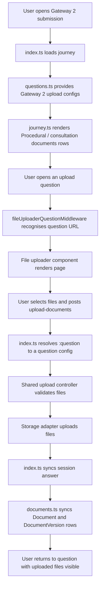
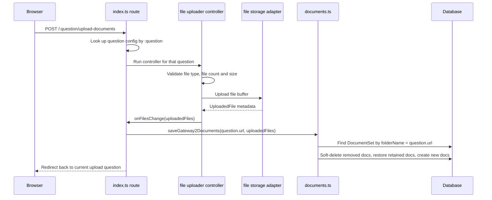
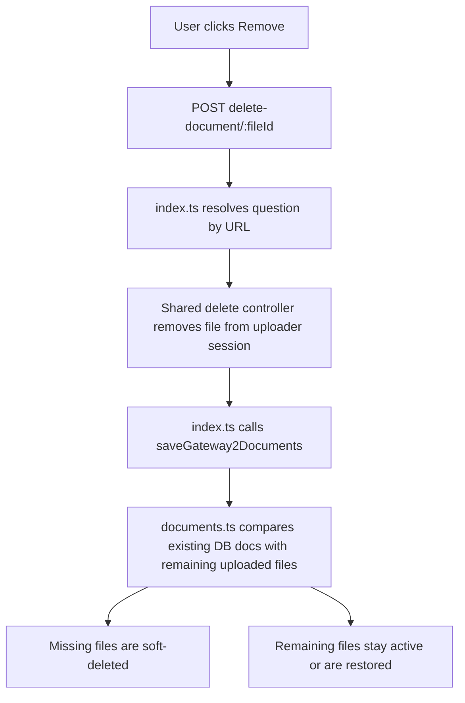

# Gateway 2 File Uploader

This document explains how the Gateway 2 submission file uploader works.

## Files Involved

| File                                                         | Responsibility                                                                                                             |
| ------------------------------------------------------------ | -------------------------------------------------------------------------------------------------------------------------- |
| `questions.ts`                                               | Defines the Gateway 2 file upload questions, their URLs, field names, copy, validators and upload limits.                  |
| `journey.ts`                                                 | Adds the upload questions to the `Procedural documents` / `Consultation documents` section of the Gateway 2 journey.       |
| `index.ts`                                                   | Registers the routes, chooses the correct uploader controller for the current question URL, keeps session answers in sync. |
| `documents.ts`                                               | Loads and saves uploaded files against `Document`, `DocumentVersion` and the matching `DocumentSet`.                       |
| `packages/database/src/seed/static-data/ids/document-set.ts` | Defines the `DocumentSet.folderName` values. These must match the upload question URLs.                                    |
| `packages/database/src/seed/static-data/document-set.ts`     | Seeds the Gateway 2 document sets used by the uploader.                                                                    |

The shared upload component itself lives under:

```text
packages/lib/forms/custom-components/file-uploader
```

## Current Gateway 2 Upload Questions

The configured questions are exported from `questions.ts` as `gateway2FileUploadQuestions`.
Each question must have a unique `fieldName` and `url`.

| Question                    | Field name                  | URL / folder name             | File count            |
| --------------------------- | --------------------------- | ----------------------------- | --------------------- |
| Gateway 2 cover letter      | `gateway2CoverLetter`       | `gateway-2-cover-letter`      | 1                     |
| Local plan timetable        | `localPlanTimetable`        | `local-plan-timetable`        | 3                     |
| Project initiation document | `projectInitiationDocument` | `project-initiation-document` | Unlimited in practice |

The `url` is important because it is used for three things:

1. The route path, for example `/procedural/local-plan-timetable`.
2. The blob folder path and upload metadata.
3. The lookup into `DocumentSet.folderName` when saving to the database.

If a new upload question is added, its `url` should also be added as a `DocumentSet.folderName` seed value.

## Shared Routes

Gateway 2 has shared routes for all file upload questions. The current question is identified by the `:question` route parameter.

```text
/:planReference/gateway-2-submission/:section/:question
/:planReference/gateway-2-submission/:section/:question/upload-documents
/:planReference/gateway-2-submission/:section/:question/delete-document/:fileId
```

There are also session-only versions of the same routes, without `:planReference`, used before a case-backed flow is loaded.

## High-Level Flow



## How `index.ts` Chooses The Right Uploader

The route is shared, so `index.ts` derives a few route-friendly structures from `gateway2FileUploadQuestions`.

```ts
const gateway2FileUploadQuestionConfigs = Object.values(gateway2FileUploadQuestions);
const gateway2FileUploadQuestionUrls = gateway2FileUploadQuestionConfigs.map((questionConfig) => questionConfig.url);
const gateway2FileUploadQuestionsByUrl = new Map(
	gateway2FileUploadQuestionConfigs.map((questionConfig) => [questionConfig.url, questionConfig])
);
```

Those values are used like this:

| Value                               | Used for                                                                                          |
| ----------------------------------- | ------------------------------------------------------------------------------------------------- |
| `gateway2FileUploadQuestionConfigs` | Loading persisted uploads for every Gateway 2 upload question when the case page opens.           |
| `gateway2FileUploadQuestionUrls`    | Telling `fileUploaderQuestionMiddleware` which question URLs are file upload pages.               |
| `gateway2FileUploadQuestionsByUrl`  | Resolving `req.params.question` to the correct upload question config during upload/delete POSTs. |

The important behaviour is:

```text
req.params.question = "local-plan-timetable"
          |
          v
gateway2FileUploadQuestionsByUrl.get("local-plan-timetable")
          |
          v
localPlanTimetableQuestion config
```

That config then supplies:

- `fieldName`, for the form answer and session key
- `url`, for blob path metadata and document set lookup
- upload validation rules, such as file count, allowed extensions and file size

## Upload POST Flow



## Delete POST Flow

Deleting a file does not physically remove the database document immediately. The uploader state is treated as the source of truth for the current answer, and `documents.ts` makes the database match that state.



## Session State

The uploader stores files in `req.session.fileUploader`.

For case-backed routes, the session key includes the plan reference and field name:

```text
LPE-TEST-001:localPlanTimetable
```

The Gateway 2 journey answer is also kept in sync under the journey ID:

```text
session.forms[planReference]["gateway-2-application"][fieldName]
```

This is what lets the check-your-answers page show `Added` / `Not added` and lets dynamic forms decide whether the journey is complete.

## Database Mapping

The database mapping deliberately uses the question URL as the `DocumentSet.folderName`.


Example:

```text
local-plan-timetable
  -> DocumentSet.folderName = local-plan-timetable
  -> DocumentSet.id = g2-timetable
  -> Document.documentSetId = g2-timetable
```

## Document Sync Behaviour

`saveGateway2Documents` accepts the full current uploader file list for one question.
It then makes the database match that list.

For each existing document in that document set:

- If the file is still present, it stays active.
- If the file was previously soft-deleted but is now present again, it is restored.
- If the file is no longer present, the `Document` and its versions are soft-deleted.

For each uploaded file with no matching existing document:

- A new `Document` row is created.
- A first `DocumentVersion` row is created.
- The `Document.latestVersionId` is set to version `1`.
- `DocumentVersion.virusCheckStatus` starts as `not_scanned`.

## Adding Another Gateway 2 Upload Question

To add another upload question:

1. Add a `FileUploaderQuestionProps` config in `questions.ts`.
2. Add it to `gateway2ApplicationQuestions`.
3. Add it to `gateway2FileUploadQuestions`.
4. Add it to the correct `Section` in `journey.ts`.
5. Add or update the matching `DocumentSet` seed so `DocumentSet.folderName` equals the question `url`.
6. Run the database seed or reset/reseed if the static data has changed.

The route layer should not need a new route. The shared dispatcher will pick it up from `gateway2FileUploadQuestions`.
